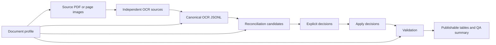

# Architecture

## Goal

The project turns independent OCR transcriptions of scanned historical record tables into auditable research datasets. It separates deterministic processing from review so every published value can be traced to source observations and an explicit decision.

The architecture does not assume that an OCR engine, a majority vote, or an agent is authoritative.

## End-to-end flow

The critical state transition is:

`candidate -> decision -> apply -> validate`

Each transition produces a separate artifact. Reviewers can therefore inspect what was proposed, what was decided, what changed, and whether the result satisfies the profile.

## Distribution layers

The public GitHub repository is the canonical distribution unit: it carries source code, profiles, synthetic fixtures, tests, documentation, release metadata, and the optional Skill. The Python package and `historical-table` CLI are the host-independent execution layer and remain usable by people, scripts, CI, Codex, Claude Code, or another agent host.

The Agent Skill is intentionally a thin, optional orchestration layer. It teaches a host when to call the CLI and how to preserve the review boundary; it does not duplicate parsing or reconciliation code. Users can therefore install the package without the Skill, or load the same Skill directory through any compatible host.

This alpha release is not packaged as a plugin yet. Plugins would provide easier installation and catalog distribution, but they would also add host-specific release surfaces while the CLI and contracts are still stabilizing. Once those interfaces are stable, Codex/ChatGPT and Claude Code plugin wrappers can each bundle this same Skill unchanged for one-click distribution, with or without later host-native integrations. The CLI and data contracts should remain authoritative even then.

## Components

### Python package and CLI

`historical-table` is the primary interface. Its flat commands are:

| Command | Responsibility |
| --- | --- |
| `profile-validate` | Validate a profile before processing data. |
| `render` | Render selected PDF pages into local page images. |
| `ocr` | Optionally call an OpenAI-compatible OCR/vision endpoint; network use requires `--allow-network`. |
| `reconcile` | Ingest two or more OCR JSONL sources, align observations, and emit consensus/conflict candidates. |
| `review-export` | Export reviewable candidates and a decision template. |
| `review-apply` | Validate and apply explicit decisions without editing source OCR. |
| `validate` | Run structural, provenance, and profile-specific checks. |
| `publish` | Produce research-facing records, long-form prices, and a QA summary. |
| `demo` | Run the synthetic demonstration without real documents. |

Every command must remain usable without an agent host. The optional Skill invokes this same CLI instead of reimplementing pipeline logic.

### Profiles

Profiles describe a table family rather than a model or agent. They define page identity, parser choice, source fields, standard fields, normalization boundaries, validation rules, and publication mappings.

- `profiles/template.yaml` is the starting point for a new table family.
- `profiles/example-records.yaml` is a completely fictional profile used only by the synthetic demonstration.

Profile validation proves that configuration is structurally well formed. The bundled example makes no claim of validation on a real corpus, and structural validation does not prove that a new publication shares the same layout or semantics.

### Data contracts

The canonical OCR contract uses logical records and cells with stable identifiers, raw and standardized representations, OCR engine provenance, and source references. Reconciliation retains every engine's candidate rather than collapsing evidence prematurely.

See [Data model](data-model.md) for the formal fields and [the Skill data contract](../skills/digitize-historical-tables/references/data-contract.md) for the review-facing summary.

### Review layer

Review is deliberately external to the deterministic core. A person or an agent may inspect candidate packets, but decisions must use the same machine-readable contract. The CLI validates decision identifiers, target uniqueness, and candidate/value consistency before applying them.

The canonical replay unit is one `cell_id` plus a `chosen_value` and review provenance. Human-readable workflow events in the synthetic ledger pass through the CLI decision compiler before they reach this core contract; they are not a parallel application path.

See [Review policy](../skills/digitize-historical-tables/references/review-policy.md).

### Agent Skill

`skills/digitize-historical-tables/` contains one model-neutral Agent Skill. It contributes procedural guidance only:

- call the repository CLI;
- inspect candidate evidence;
- record decisions rather than editing outputs;
- run validation before publication.

It contains no Claude-specific tools, Codex-only commands, model names, or local paths. `agents/openai.yaml` supplies optional UI metadata and does not change the portable `SKILL.md` workflow.

## Artifact boundaries

A run should keep these lanes distinct:

1. **Sources** — user-owned PDFs, images, and raw OCR outside version control.
2. **Canonical OCR** — immutable JSONL with engine and source provenance.
3. **Candidates** — machine-generated agreements, conflicts, omissions, and ambiguities.
4. **Decisions** — explicit, reviewable selections or unresolved states.
5. **Applied data** — records constructed from sources plus decisions.
6. **Validation and publication** — QA evidence and research-facing exports.

Published artifacts should identify the software version, profile, input hashes, OCR engines, decisions, and validation result whenever the selected output format permits it.

## Extension boundary

Add a profile when the observation unit and parser already fit. Add a parser only when a new table geometry cannot be represented by an existing parser. Do not add publication names or one-off exceptions to core reconciliation code.
